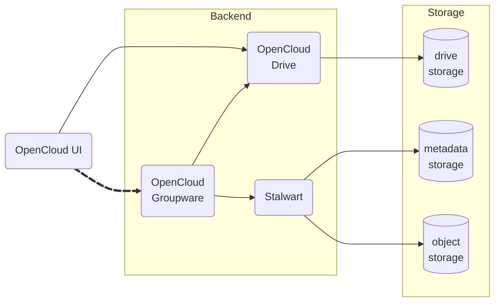
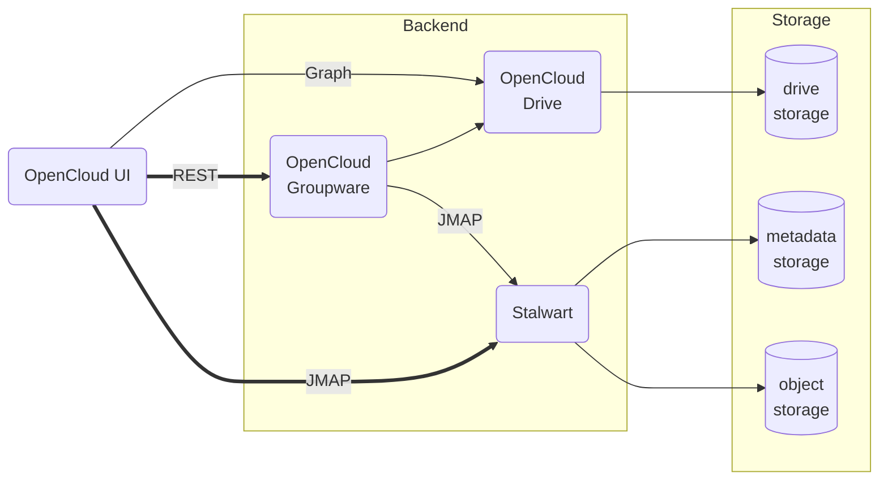
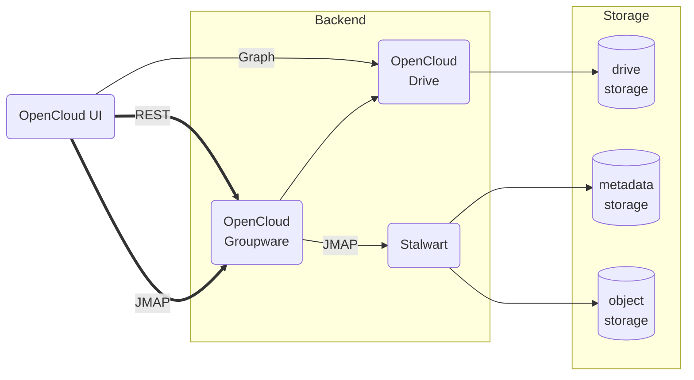
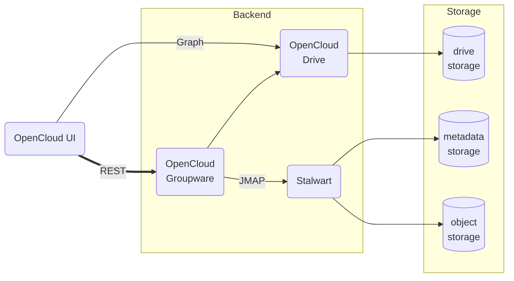

* Status: draft

## Context

We need a comprehensive HTTP API for the OpenCloud Web UI to provide access to the following (upcoming) modules and Groupware functionalities:

* Mail
* Contacts
* Calendar
* Tasks
* Chat
* Configuration



Currently, communication between UI client and backend services is done via the [LibreGraph API](https://github.com/opencloud-eu/libre-graph-api) based on [Microsoft Graph](https://developer.microsoft.com/en-us/graph). An alternative is an independent API tailored to fit the specific needs of the Groupware modules.

## Decision Drivers

* adoption must be significantly driven by the UI developers, since they are the sole consumers of the API
* reduction of complexity and implementation efforts
* efficiency (e.g. less roundtrips)

Aspects that are *not* relevant for the decision:

* use of standards: since the API will exclusively be consumed by the OpenCloud UI, there is no incentive to use an existing standard API that would offer
  * compatibility with other clients
  * third party documentation and educational resources
* documentation: for the same reason, documentation only needs to be provided internally for implementation purposes by the OpenCloud UI team and external contributors, but is not intended for consumption by third party applications, which may *reduce* (not remove) the documentation efforts

## Considered Options

* LibreGraph
* JMAP
* a custom REST API

## Decision Outcome

TODO

### Consequences

TODO

### Confirmation

TODO

## Pros and Cons of the Options

### LibreGraph

Example:

```text
GET /v1.0/me/messages?$select=sender,subject&$count=50&$orderby=received
```

#### Good

* is already in use as the API for OpenCloud Drive operations

TODO: more advantages of using LibreGraph {<j.dreyer@opencloud.eu>, <m.bartz@opencloud.eu> ?}

#### Neutral

* does not have to follow the Microsoft Graph API, can be customized to our own needs, but in which case it becomes doubtful that there is any benefit in mimicking the Graph API in the first place if we diverge from it

* there is no compatibility benefit, since the only MUA that uses the Microsoft Graph API is Microsoft Outlook, and it is not a goal to support Microsoft Outlook as a MUA beyond standard IMAP/SMTP/CalDAV/CardDAV services (and that would be Microsoft Graph, not LibreGraph nor any customizations we would require)

* in a similar vein, we will not implement all the aspects of the Microsoft Graph API, which renders any compatibility aims moot while conserving all of the complexity drawbacks

#### Bad

* not an easy API to implement, although we have libraries that take care of some of the more complex parts, such as parsing [OData](https://www.odata.org/) expressions
* not tailored to our needs, and we will most probably have a lot of cases in which we have to twist the Graph API to express what the UI needs by using complex filters, which then require complex parsing in the backend in order to translate them into JMAP, as opposed to directly using an expressive and maximally matching API in the first place
* does not support multiple accounts per user
* more implementation effort than JMAP

### JMAP

Example of a JMAP request that

* fetches the 30 last received emails from a mailbox (folder)
* the threads of those emails
* email metadata of all of those threads, including a preview

```json
[[ "Email/query", {
  "accountId": "ue150411c",
  "filter": {
    "inMailbox": "fb666a55"
  },
  "sort": [{
    "isAscending": false,
    "property": "receivedAt"
  }],
  "collapseThreads": true,
  "position": 0,
  "limit": 30,
  "calculateTotal": true
}, "0" ],
[ "Email/get", {
  "accountId": "ue150411c",
  "#ids": {
    "resultOf": "0",
    "name": "Email/query",
    "path": "/ids"
  },
  "properties": [
    "threadId"
  ]
}, "1" ],
[ "Thread/get", {
  "accountId": "ue150411c",
  "#ids": {
    "resultOf": "1",
    "name": "Email/get",
    "path": "/list/*/threadId"
  }
}, "2" ],
[ "Email/get", {
  "accountId": "ue150411c",
  "#ids": {
    "resultOf": "2",
    "name": "Thread/get",
    "path": "/list/*/emailIds"
  },
  "properties": [
    "threadId",
    "mailboxIds",
    "keywords",
    "hasAttachment",
    "from",
    "subject",
    "receivedAt",
    "size",
    "preview"
  ]
}, "3" ]]
```

#### Good

* very flexible protocol that can easily be implemented by clients
* potentially does not require implementation efforts on the backend side
* would obviously support the full potential of JMAP and Stalwart

#### Neutral

* JMAP will not cover 100% of the Web UI API needs (e.g. configuration settings, [resource linking](./0003-groupware-resource-linking.md), ...), but that does not prevent us from implementing additional custom APIs
* would need to gauge whether JMAP communication should occur directly between the OpenCloud UI and Stalwart, or whether an OpenCloud Groupware service should be used as an intermediary

##### Directly to Stalwart



##### Groupware intermediary



#### Bad

* potentially bad: most probably too flexible for its own good, as it makes it difficult to reverse-engineer the high-level meaning of a set of JMAP requests in order to capture its semantics, e.g. to implement caching or reverse indexes for performance

> [!NOTE]  
> This seems like a mild "bad" item, but the risk risk here is significant: if it turns out that we need to capture the semantics of API requests to perform additional operations (e.g. caching or indexing for performance reasons, or to decorate the data from Stalwart with information from other services), then we would have to re-implement the whole API as JMAP is too complex to parse to extract semantics from.

### Custom REST API

A custom REST API would implement the resources and semantics as they are needed by the UI, and would be strongly if not fully UI-driven.



Example:

```text
GET /groupware/startup/1/?mails=50
```

#### Good

* completely tailored to the needs of the OpenCloud UI
* a higher-level API allows for easily understanding the semantic of each operation, which enables the potential for keeping track of data in order to implement reverse indexes and caching, if necessary to achieve functional or performance goals, as opposed to using a lower-level API such as JMAP which is maximally flexible and difficult to reverse-engineer the meaning of the operation and data
* can also be tailored to the capabilities of JMAP without exposing all of its flexibility
* provides the potential for expanding upon what JMAP provides
* would support the full potential of JMAP and Stalwart since the API would be designed accordingly

#### Neutral

* does not follow any standard (besides REST), although the purpose is solely to build an API for the OpenCloud UI, not an API that is meant to be consumed by many different clients

#### Bad

* more implementation effort than JMAP
